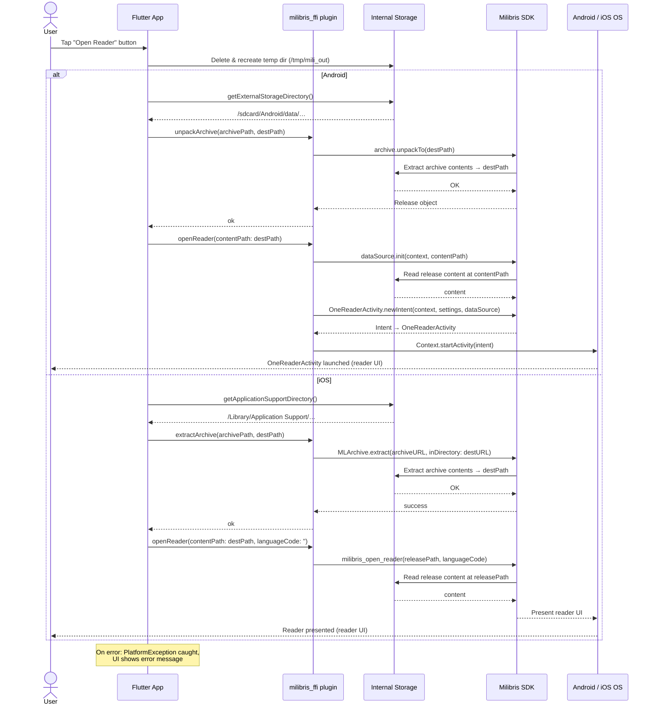

# Reader Opening — Sequence Diagram

```mermaid
sequenceDiagram
    actor User
    participant App as Flutter App
    participant Bridge as milibris_ffi plugin
    participant Storage as Internal Storage
    participant SDK as Milibris SDK
    participant OS as Android / iOS OS

    User->>App: Tap "Open Reader" button

    App->>Storage: Delete & recreate temp dir (/tmp/mili_out)

    alt Android
        App->>Storage: getExternalStorageDirectory()
        Storage-->>App: /sdcard/Android/data/…
        App->>Bridge: unpackArchive(archivePath, destPath)
        Bridge->>SDK: archive.unpackTo(destPath)
        SDK->>Storage: Extract archive contents → destPath
        Storage-->>SDK: OK
        SDK-->>Bridge: Release object
        Bridge-->>App: ok

        App->>Bridge: openReader(contentPath: destPath)
        Bridge->>SDK: dataSource.init(context, contentPath)
        SDK->>Storage: Read release content at contentPath
        Storage-->>SDK: content
        Bridge->>SDK: OneReaderActivity.newIntent(context, settings, dataSource)
        SDK-->>Bridge: Intent → OneReaderActivity
        Bridge->>OS: Context.startActivity(intent)
        OS-->>User: OneReaderActivity launched (reader UI)

    else iOS
        App->>Storage: getApplicationSupportDirectory()
        Storage-->>App: /Library/Application Support/…
        App->>Bridge: extractArchive(archivePath, destPath)
        Bridge->>SDK: MLArchive.extract(archiveURL, inDirectory: destURL)
        SDK->>Storage: Extract archive contents → destPath
        Storage-->>SDK: OK
        SDK-->>Bridge: success
        Bridge-->>App: ok

        App->>Bridge: openReader(contentPath: destPath, languageCode: '')
        Bridge->>SDK: milibris_open_reader(releasePath, languageCode)
        SDK->>Storage: Read release content at releasePath
        Storage-->>SDK: content
        SDK-->>OS: Present reader UI
        OS-->>User: Reader presented (reader UI)
    end

    note over App: On error: PlatformException caught,<br/>UI shows error message
```
